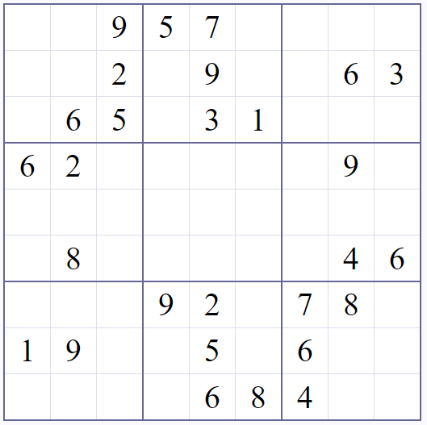
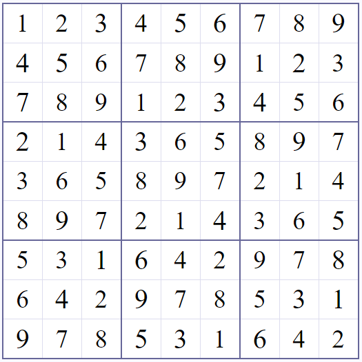

# Sudoku solver

This solver supports various dimensions of Sudoku, but with the condition that the number of rows matches the number of columns (square Sudoku). The standard Sudoku has a dimension of 9x9.

### Strategies

Several strategies have been implemented to find Sudoku solutions:
- Naked Single
- Hidden Single
- Naked Pair
- Pointing Pair
- Depth First Search

Depth First Search generates all possible solution combinations and stops at the first solution found. No conditions are required for this strategy.

The other strategies observe specific conditions and determine a solution if the conditions of the strategy are met.

Among the implemented strategies, Naked Pair and Pointing Pair reduce candidates, while the other strategies calculate solutions for individual cells if the conditions of the strategy are met.

Since Depth First Search always generates a solution, the speed of generating the solution greatly depends on the number of solution to generate and test whether the Sudoku solution is correct. It is possible to combine the first four strategies and if no solution is found, use Depth First Search.

Depending on the initial values of the Sudoku, it is possible that Naked Pair and Pointing Pair reduce candidates and Naked Single and Hidden Single do not find solutions (the conditions for triggering the strategy are not met). In such situations, Depth First Search is faster.

In general, Depth First Search is relatively highly optimized, together with a list of candidates (a sorted ascending list of candidates), so finding a solution typically takes around 2-3 ms on average for Sudoku 9x9 with Depth First Search only and around 4-6 ms with combination of all strategies.

The Solve method combines all strategies, with Depth First Search being the final resort.

### Samples

For example, this Sudoku can be solved using only the Naked Single strategy:

For example, this Sudoku was generated using the Depth First Search algorithm (initial values were empty):

### Invalid or no solution

If the initial values are incorrect, the Sudoku solver will display an appropriate message. Similarly, if it is not possible to calculate a solution, it will also notify accordingly.